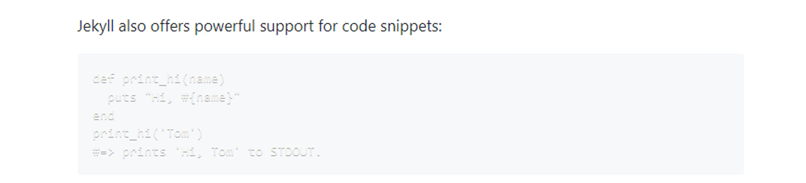

上文书说道，个人博客已经安装且发布完成。那么，作为一个追求完美的理科男，免不了继续折腾。

由于自己不是前端开发，且亦不是页面设计，空有一副爱美之心，但委实没有设计美的能力，于是乎，还是在网上寻摸吧。

网上的Jekyll主题很多，但直入眼帘的就是[廖柯宇](https://liaokeyu.com/)的**[或许是最漂亮的 Jekyll 博客主题: H2O](https://github.com/kaeyleo/jekyll-theme-H2O)**


哎呦，不错呦，是我很喜欢的风格。搞过来~

说实话，在H2O之前也搞了几个主题，但是都碰到了这样那样的问题，不是Jekyll版本不匹配，就是缺少gem，不一而足，基本上没有一蹴而就的。
但是这个主题真是意外之喜，`jekyll serve`，一点问题没有，老顺畅了！

但是，运行预览没问题，不代表可以完全代替你的Blog，要想功能齐全并且展现你自己的小心思，还是需要各种小调整的。


### 1. `_config.yml`的调整

```yaml
   # Author 配置博主信息
   author: '赵楠'
   nickname: 'leozhao0202'
   bio: ' 热爱研究技术 & 深挖历史<p>简单乐观 最求完美'
   avatar: 'assets/img/head.jpg'

   # Navigation links
   nav:
     home: '/'
     tags: '/tags.html'
     about: '/about.html'
   
   # Comments 评论功能
   gitalk_shortname: leozhao0202
   
   # Share
   social-share: true
   social-share-items: ['wechat', 'weibo', 'douban']
   
   # SNS settings 配置社交网站
   sns:
     weibo: '//weibo.com/1676238131'
     email: 'leozhao0202@outlook.com'
     github: '//github.com/leozhao0202'
     jianshu: '//www.jianshu.com/u/b4fe2ce9d9e5'
   
   # QRcode 首页二维码设置
   QRcode: true

   # statistic analysis 统计代码
   # 百度统计 id，将统计代码替换为自己的百度统计id
   baidu_tongji_id: xxxxxxxxxxxxxxxxxxxxxxxxxxx
```

   `# Author 配置博主信息`：这里主要配置你的基本信息，展示你的个性。`avatar`是你的头像，请自拍一张自认为帅到溢于言表的selfie，放到`assets/img/`文件夹内，并在此设置。

   `# Navigation Links`：这里定义在首页页首出现的菜单项，比如主题Demo原本只有home和tags，我自己增加了about页面。

   `# Comments 评论功能`：主题原本使用的是Disqus评论系统，但是很遗憾的是国内已无法访问了。还有无数博客中提及的**多说**、**友言**等等第三方评论系统，可惜都相继关闭了，然后还有搜狐的**畅言**系统，注册后才发现只有经过备案的网站才能使用，这个......嗯，我是经历过网站备案的，旷日持久（不知道现在是不是简便了）。我自己一个个人小博客，就没必要去备案了吧。所以找来找去，还是选择了Github自己的Gitalk。

   `# SNS settings 配置社交网站`：这个是配置访问你的其他社交网站的快捷方式，就在首页你的头像下面，主要支持**email, weibo, zhihu, twitter, instagram, juejin, github, douban, facebook, dribble, uicn, jianshu, medium, linkedin**

   `# QRcode 首页二维码设置`：这个是我在首页增加的一个二维码，便于手机用户直接访问。（本主题对手机用户的支持还是很好的。）

   `# Share`：这个是第三方分享系统Share.js，支持以下社交站点。


   `#statistic analysis 统计代码`：原主题未添加统计模块，因此我在此增加了百度统计（谷歌的统计由于众所周知的原因是访问不了的......），详情请参考所链接文章[Jekyll搭建博客并添加百度统计](https://www.jianshu.com/p/9a062041394e)

   

### 2. 修改首页中的标题和图片

   这个并未放在`_config.yml`中，后面如果有时间，我琢磨着还是把它放到`_config.yml`中更方便吧。

   OK，那么它在哪儿呢？在index.html中的头文件信息中。

```yaml
---
layout: default
home-title: 赵楠的故纸堆
description: 这里是我的记忆深处，一个理科男的善感多思
header-img: assets/img/banner.jpg
qrcode-img: assets/img/qrcode.png
---
```

   `header-img`：就是主题首页正上方的图片，找一个自己喜欢的jpg或者png放到`assets/img/`文件夹内，然后在此定义即可。

   `qrcode-img`：首页二维码图片，这个还涉及到index.html的部分代码修改，后面会细说。

   

### 3. 增加评论功能

   如上面所述，我最终选择了Gitalk作为评论系统。关于如何为自己的博客增加Gitalk评论系统，请参考所链接文章[Jekyll博客添加GitTalk评论](https://gorpeln.com/article/15419058710)。

   以下是我增加的一个comments.html页面，放在`_includes`文件夹内。

```html


<!-- Gitalk评论框 start -->
<!-- Link Gitalk 的支持文件  -->
        <link rel="stylesheet" href="https://unpkg.com/gitalk/dist/gitalk.css">
        <script src="https://unpkg.com/gitalk@latest/dist/gitalk.min.js"></script> 
        <div id="gitalk-container"></div>
        <script type="text/javascript">
            var gitalk = new Gitalk({
            // gitalk的主要参数
                clientID: 'xxxxxxxxxxxxxx',
                clientSecret: 'xxxxxxxxxxxxxxxxxxxxxxxxxxxxxxxxx',
                repo: 'leozhao0202.github.io',
                owner: 'leozhao0202',
                admin: ['leozhao0202'],
                id:window.location.pathname,
            });

            gitalk.render('gitalk-container');
        </script> 
<!-- Gitalk end -->


```

*其中clientID和clientSecret是在Github-->Settings-->Developer settings-->OAuth Apps设置完成后，Github提供的字符串。*

然后修改`_layouts`文件夹内的`post.html`页面，在**原disqus相关代码下**增加引入上文新建的`comments.html`。

```html
    <!--主题原本使用的disqus评论相关代码 -->
    
    <section class="post-footer-item comment">
        <div id="disqus_thread"></div>
    </section>
    
    <!--增加引入comments的代码 -->
    
    <section class="post-footer-item comment">
      <h2 id="comments">评论</h2>
      
    </section>
    
```


### 4. 首页增加QRcode

1.  在`_config.yml`中设置`QRcode: true`

2.  先在二维码制作的网站上生成一个你的博客网址的二维码，然后放到`assets/img/`文件夹内并在`index.html`文件头信息中定义。

3. 修改`index.html`文件，在**显示标签tags的相关代码下**增加QRcode显示代码。

   ```html
   <!--主题中显示标签tags的相关代码  -->
    
     <section class="tags-card">
       
         
           
         
         <a href="{{ "tags.html#" | append: tag[0] | relative_url }}" 
            class="tag">{{ tag[0]}}</a>
       
     </section>
    
   <!--增加显示QRcode的代码 -->
    
     <section class="sns-links" >
        <div class="avatar" align="center">                    
           
        </div>
     </section>
    
   ```
   


### 5. 代码显示以及高亮的问题

   以上修改完成后就基本完成修改，日后再有改动日后再说。

   但是在编辑文章时，由于之前没接触过markdown，所以还是遇到了一些问题，这里先说一下***代码的显示***。也许你说，不是有关于代码块的说明吗，只要用一对```括起来就行啦。

   呵呵，可惜，代码块不是万能的，有很多语句放到代码块里会出错，或者会执行你原本只是想展示的代码，造成文章错乱。{% assign openTag = '

   那该咋办呢？好在YAML语言给出了办法，在出问题的代码前后增加`{{ openTag }} raw %}`和`{{ openTag }} endraw %}`即可。

   ***注意，不建议对整篇文章增加`{{ openTag }} raw %}`和`{{ openTag }} endraw %}`，那样反而会影响代码的高亮。***


   下面紧接着就是代码高亮的问题，请见下图。



   这是个啥呀！可以说是啥都看不见啊！这个问题搞了好久，尝试修改css，也不行。

   嗯，感觉主题所带的代码高亮插件prism.js没起作用啊。最后，还是上[prism的官网](https://prismjs.com/)下载了最新的js和css，才最终搞定。

### 6. 未竟事宜

   我一直没搞定的就是文章中字体颜色的问题，事实上我在本地通过Jekyll预览时，以下代码是没问题的，可以正确显示字体颜色，但是同步到Github后就不行了，也许是Github不支持吧。

<font color="navy">这段字应该是深蓝色的。</font>

```html
<font color="navy">这段字应该是深蓝色的。</font>
```

